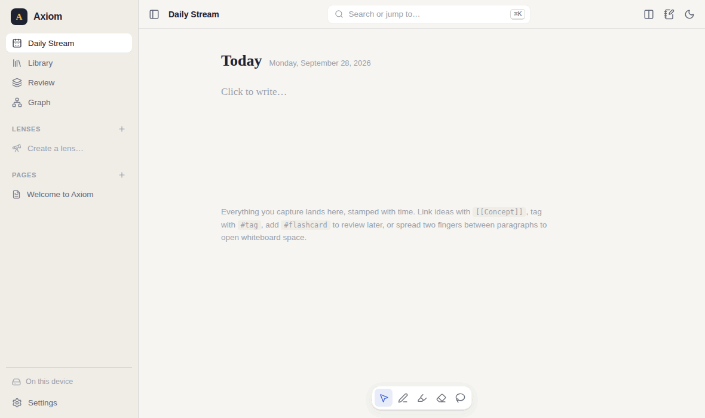
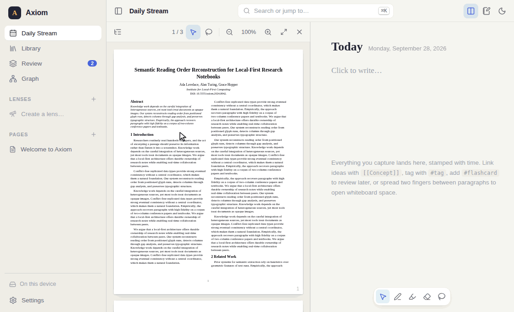
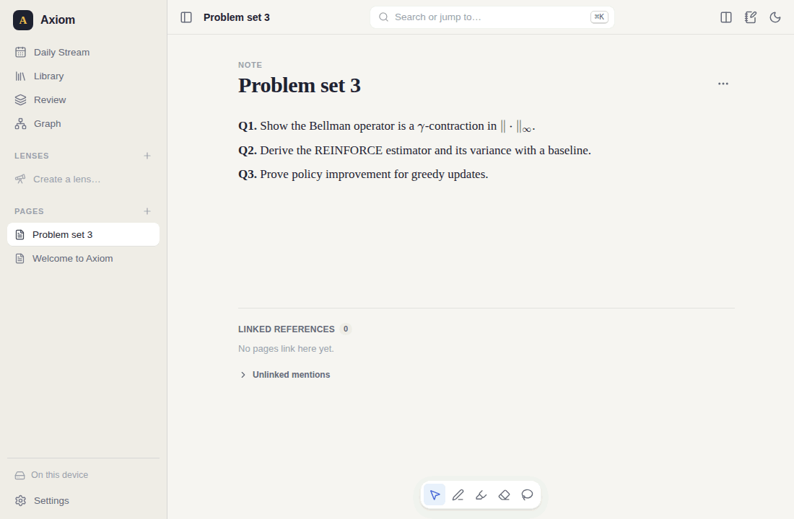
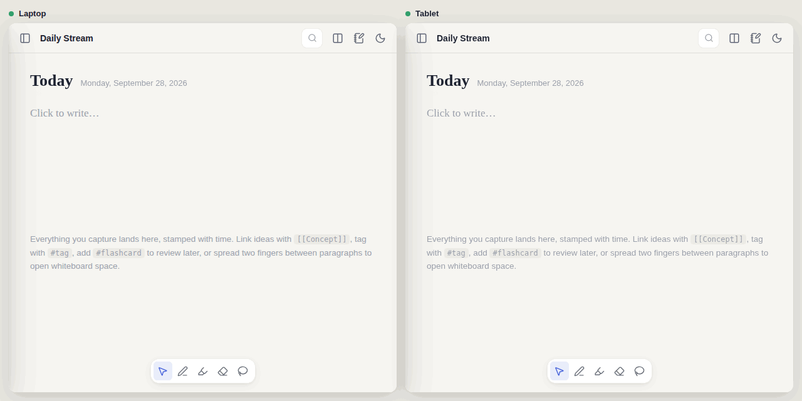
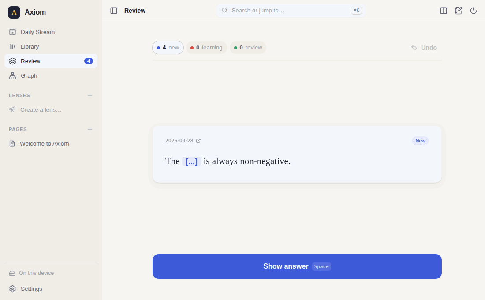
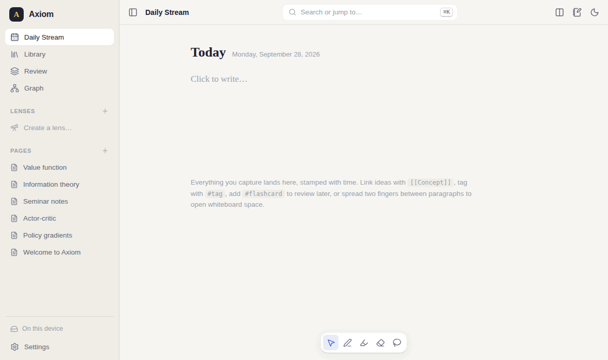

# Axiom

**A zero-cost, local-first knowledge operating system for researchers.** Read massive textbooks, double-column papers and slide decks in a pristine *Library*; think, derive and write on an elastic *Desk*; move ideas between them with a lasso — and never pay for a server.

Axiom is a Progressive Web App (installable on desktop, iPad and Android) built on CRDTs. Your notes live on your devices, sync between them in real time with end-to-end encryption, and are silently backed up to your own GitHub/GitLab repository.

<p align="center">
  
</p>

🎬 **[Demo video](video/out/axiom-demo.mp4)** (2:50): eight features, then a three-minute setup guide. There's also a [60-second vertical teaser](video/out/axiom-teaser-vertical.mp4). Both are generated from code in [`video/`](video/README.md), using footage of the real app.

📖 **[User guide](docs/index.html)** — installation, a 5-minute tour, every feature, keyboard shortcuts and troubleshooting. Enable GitHub Pages (Settings → Pages → branch, folder `/docs`) to serve it at `https://<you>.github.io/axiom/`.

## See it in action

Every animation below was recorded from the real production build by an automated browser script (`npm run demos`).

<table>
  <tr>
    <td width="50%" valign="top">
      
      <p><b>Lasso &amp; Drop.</b> Circle a passage in a two-column paper; it lands on the Desk as clean Markdown with a ⚓ Wormhole anchor that jumps back to the exact spot.</p>
    </td>
    <td width="50%" valign="top">
      
      <p><b>Elastic canvas &amp; Beautify.</b> Spread two fingers between paragraphs to open whiteboard space, sketch, then double-tap a lasso selection to snap shapes clean (reversible).</p>
    </td>
  </tr>
  <tr>
    <td width="50%" valign="top">
      
      <p><b>Real-time sync.</b> Two devices edit the same page; CRDT merges mean no conflicts, online or offline.</p>
    </td>
    <td width="50%" valign="top">
      
      <p><b>Flashcards.</b> Tag any block <code>#flashcard</code>; cloze cards are generated and scheduled with FSRS.</p>
    </td>
  </tr>
  <tr>
    <td colspan="2" valign="top">
      
      <p><b>Search, graph &amp; Lenses.</b> ⌘K search across everything, a force-directed knowledge graph, and Lenses that gather live, editable blocks from across the vault.</p>
    </td>
  </tr>
</table>

---

## Features

| PRD area | What you get |
| --- | --- |
| **Daily Stream** | Infinite, time-stamped canvas; today on top, earlier days lazily loaded below. Every block shows when it was written. |
| **Elastic Canvas** | Spread two fingers between paragraphs to inject whiteboard space; pinch to snap it shut. Trackpad pinch (Ctrl+wheel) and a “+” gap button do the same on laptops. |
| **Inking** | Low-latency pointer-event ink (coalesced + predicted events, desynchronized canvas, palm rejection), pressure via `perfect-freehand`, highlighter, eraser, lasso. |
| **Beautify** | Lasso messy ink, double-tap: shapes snap to aligned, colour-coded SVG (lines, arrows, circles, boxes, triangles, diamonds); handwriting → text and math → LaTeX via AI. Always reversible — raw ink is never deleted. |
| **Source Vault** | PDF (pdf.js, virtualised for 800-page books), EPUB, PPTX. Remembers scroll position and zoom per document across devices, extracts TOC into a side tree, persists highlights. |
| **Slide stacking** | Landscape decks are detected and streamed vertically; *Seminar notebook* stacks every slide with whiteboard space beneath it. |
| **Lasso & Drop** | Lasso any paragraph, equation or figure (stylus, Alt+drag or lasso tool). Two-column reading order, de-hyphenation, headings and lists are reconstructed into Markdown; equations become LaTeX (exact via vision AI when configured); figures become images. Drag the preview onto the Desk or “Send to Desk”. |
| **Wormhole anchors** | Every extracted block keeps a tether; the ⚓ button slides the Library open at the exact page and region, flashing it. |
| **Side-Quest panel** | A right-hand scratchpad for looking up concepts/citations without losing your place (Ctrl+.). |
| **Knowledge graph** | `[[links]]`, `#tags`, `![[transclusions]]` (live and editable inline), backlinks + unlinked mentions, force-directed graph view, full-text search (BM25, prefix + fuzzy). |
| **Lenses** | Saved dynamic workspaces: `[[Reinforcement Learning]] OR source:"Paper A" OR source:"Paper B"`, `is:flashcard type:math after:2026-01-01`, … Results are live and editable in place. |
| **Ghost tags & auto-merge** | On import, suggested tags from your existing graph appear in light grey — tap to confirm. A background job proposes merging duplicates (RL ↔ Reinforcement Learning, MDPs ↔ MDP). |
| **Spaced repetition** | `#flashcard` on any Desk block → auto-generated cloze cards (explicit `{{c1::…}}` respected), FSRS-5 scheduling with Again/Hard/Good/Easy, scheduling stored in the CRDT (offline sync), leech detection surfaces the Wormhole anchor. |
| **Publishing** | Drag blocks out as Markdown / LaTeX / SVG into Overleaf, VS Code or any editor; export pages as `.md` or `.tex`; copy as Markdown/LaTeX. |
| **Citations** | Standardised BibTeX keys on import (`lastnameYEARword`), DOI/arXiv detection, Crossref lookup, two-way Zotero Web API sync, `.bib` import/export for Mendeley & Better BibTeX. |
| **Zero-cost AI** | Router over: built-in heuristics (always on), Gemini free tier, any OpenAI-compatible endpoint (incl. Ollama/LM Studio/OpenRouter), your Anthropic key, an on-device WebGPU model, and a copy-paste “subscription bridge” to your ChatGPT/Claude web account. |

## Quick start

```bash
npm install
npm run dev            # http://localhost:5173
npm run relay          # optional: local sync relay on :8787
```

Production build (PWA, works offline): `npm run build && npm run preview`.

### Linking devices

1. **Settings → Sync & backup → Create a sync key**, enter a relay URL (run `server/relay.mjs` anywhere — see [server/README.md](server/README.md)), enable real-time sync, **Save**.
2. Copy the join code (or link) and paste it on the other device → **Join** → **Save**.

Frames are encrypted with AES-GCM using a key derived from the sync secret; the relay only sees an opaque room id and ciphertext, and stores nothing. Tabs on one device sync over `BroadcastChannel` with no server at all.

### Git backup

Add a GitHub (or GitLab) personal access token and a repository in Settings. Axiom commits in the background: CRDT state per document under `axiom/docs/`, optional source files under `axiom/files/`, and a human-readable Markdown mirror under `axiom/markdown/`. Merges are conflict-free because every document is a CRDT — concurrent pushes from two devices simply merge.

## Architecture

```
src/
  core/                 framework-free logic (unit-tested)
    storage/            IndexedDB update log + DocStore (lazy Y.Docs, LRU, compaction)
    sync/               multiplexed sync protocol, BroadcastChannel, encrypted relay, Git (GitHub/GitLab)
    graph/              link/tag parser, derived index + search, lenses, similarity, merge, ghost tags
    srs/                FSRS-5, cloze generation, card sync, queue
    ink/                geometry, smoothing, rendering, shape recognition, clustering, beautify
    ingest/             pdf.js analysis, reading-order extraction, EPUB & PPTX parsers
    citations/          BibTeX, cite keys, Crossref, arXiv, Zotero, Mendeley (.bib)
    ai/                 zero-cost router + providers
    export/             Markdown / LaTeX exporters
  ui/                   React 19 app
    app/                shell, routing, palette, settings, bootstrap
    desk/               block editor (CodeMirror 6 ⇄ Y.Text), stream, pages, lenses, accordion, side quest
    library/            reader (PDF/EPUB/PPTX), lasso, extraction, seminar notebooks
    ink/  graph/  review/
server/                 stateless WebSocket relay (only dependency: ws)
tests/e2e/              Playwright end-to-end, touch-gesture, sync and performance tests
```

**Data model.** A vault is a set of Yjs documents: an always-loaded *index* doc (page registry, sources, reading positions, highlights, flashcards, lenses, synced settings) and one doc per page (ordered blocks). Every edit is a CRDT update appended to an IndexedDB log (batched, compacted in a single transaction), broadcast to peers, and committed to Git. Page docs load lazily and are evicted from an LRU, and the sync layer can answer peers for documents that are not even loaded (operating on binary updates), so vaults with thousands of pages stay light. Daily and concept pages have deterministic ids, so two offline devices creating `[[Bellman equation]]` converge on one page.

**Secrets** (sync key, Git token, AI keys) are stored only in local IndexedDB — never in the CRDT, never committed.

## Testing

```bash
npm test               # 398 unit tests (Vitest)
npm run test:e2e       # 28 end-to-end tests (Playwright, desktop + tablet touch profiles)
npm run typecheck
npm run demos          # re-record the README / guide animations (needs `npm run preview` running)
```

The e2e suite covers editing, linking, lasso extraction + Wormhole jumps, highlights, a 300-page textbook, seminar notebooks, EPUB/PPTX, two-finger accordion gestures (real CDP touch events), FSRS reviews, two-device encrypted sync through the relay, multi-tab sync, and performance budgets (2,000-block pages, 10k-block search, textbook flinging).

## Known limitations

- **Native ink APIs.** Axiom is a web app, so it uses Pointer Events (coalesced + predicted points, a desynchronized canvas) rather than PencilKit / Android Ink. Latency is very good on modern iPadOS/Android browsers, but not identical to a native app.
- **Handwriting & math recognition need a model.** Shapes are recognised offline; handwriting → text and ink → LaTeX use whichever AI provider you configure (Gemini free tier, a local Ollama model, your own key, or the copy-paste bridge). Without one, ink stays ink.
- **Subscription bridging is copy & paste.** Axiom opens your ChatGPT/Claude tab with the prompt on the clipboard; it never scrapes or automates those sites.
- **Mendeley** has no open API without an OAuth app, so sync is via `.bib` export/import (Zotero has full two-way Web API sync).
- **Page metadata edited on two devices before they first sync** (e.g. renaming the same concept page offline on both) resolves last-writer-wins for that page's metadata; page *content* always merges.
- **arXiv lookups** may be blocked by CORS in some browsers; DOI metadata (Crossref) works everywhere.
- **PPTX rendering** covers text, pictures, basic shapes, groups and notes; charts, SmartArt and EMF images are not drawn (export to PDF for full fidelity).

## License

MIT
